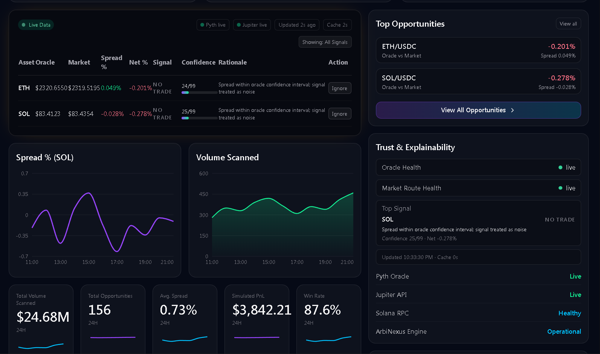

# ArbiNexus

Oracle-informed arbitrage intelligence for Solana.

[Public project overview](https://docs.google.com/document/d/e/2PACX-1vQVMXoOJHKBM8CXrtgX0fWPPoyYD0TO6siyPXm2V0xc0dHDkv1Q6RLkUFMBtEyZw7XB9ad_ABmrpaoa/pub)

ArbiNexus compares live oracle fair value against live executable market quotes,
classifies opportunities after fees, and provides explainable paper-trade simulation
before any capital is committed.

Built for the Colosseum Hackathon.

## Screenshot



## Problem

On-chain markets can temporarily diverge from oracle fair value.
Most users cannot detect those windows fast enough, and most bots are opaque.

## Solution

ArbiNexus provides a transparent intelligence layer that:

1. Pulls oracle prices from Pyth (Hermes API)
2. Pulls executable market quotes from Jupiter v6
3. Computes spread and net edge after fee estimates
4. Classifies signals as BUY_MARKET, SELL_MARKET, or NO_TRADE
5. Surfaces rationale and confidence context for each signal
6. Simulates trade outcomes in paper-trade mode

## Why Now

Solana now has the right combination of low-latency execution, deep liquidity routing,
and high-frequency oracle infrastructure.
As tokenized assets mature, oracle-vs-market dislocations become more important to
detect and explain in real time.

## Architecture


```text
Pyth Hermes + Jupiter v6
					|
					v
packages/sdk (pyth.ts, jupiter.ts, arbitrage.ts)
					|
					v
apps/api (Fastify)
	- /prices
	- /opportunities
	- /simulate
	- /execute (simulated hook)
	- /stream/opportunities (SSE)
					|
					v
apps/web (Next.js)
	- Opportunities table
	- Trust panel
	- Health badges
	- Inline simulation
	- Wallet balance
```

Detailed diagram and flow: see [docs/architecture.md](docs/architecture.md).

## Signal Logic

```text
SpreadPct = (OraclePrice - MarketPrice) / OraclePrice * 100
NetPct    = SpreadPct - EstimatedFeesPct

if NetPct > threshold and outside confidence band  -> BUY_MARKET
if NetPct < -threshold and outside confidence band -> SELL_MARKET
otherwise                                          -> NO_TRADE
```

## Tech Stack

- Next.js 15 + TypeScript + Tailwind (frontend)
- Fastify + Zod (backend)
- Server-Sent Events for live updates
- Pyth Hermes + Jupiter v6 integrations
- Solana wallet adapter + Solana web3
- pnpm workspaces + Turborepo monorepo

## API Endpoints

| Method | Endpoint | Description |
|---|---|---|
| GET | /health | API health status |
| GET | /prices | Current oracle and market prices |
| GET | /opportunities | Current classified opportunities |
| GET | /opportunities/:symbol | Signal detail for one symbol |
| POST | /simulate | Paper-trade simulation output |
| POST | /execute | Devnet-safe simulated execution hook |
| GET | /stream/opportunities | SSE stream of opportunities |

## Running Locally

### Prerequisites

- Node.js 18+
- pnpm 8+

### Install

```bash
pnpm install
```

### Configure

Create env files from templates where needed.

API defaults are centered on devnet and local development.

### Start

```bash
# API
pnpm --filter @arbinexus/api dev

# Web
pnpm --filter @arbinexus/web dev
```

- Dashboard: http://localhost:3000
- API health: http://localhost:3001/health

## Demo Flow (2 minutes)

1. Show live health badges (Pyth and Jupiter states)
2. Show opportunities table with spread, net, signal, rationale
3. Toggle actionable-only filter
4. Run Simulate Trade on a row and explain the result
5. Use Trust and Explainability panel to describe decision policy

Full script: see [docs/demo-script.md](docs/demo-script.md).

## Demo Video

- [ArbiNexus Video Demo (YouTube)](https://youtu.be/G2c4WNlbrwI)
- [Local Backup Demo File](./docs/ArbiNexus-Video-Demo.mp4)

## Judging Criteria Alignment

See [docs/judging-map.md](docs/judging-map.md) for a direct mapping to technical execution,
originality, usability, and ecosystem fit.

## Current Limitations

- Asset set is intentionally narrow for MVP reliability
- /execute remains simulated by design for hackathon safety
- Opportunity frequency depends on live market conditions
- Local wallet ecosystem may emit non-blocking peer warnings

## Project Structure

```text
apps/
	web/      Next.js dashboard
	api/      Fastify API service
packages/
	sdk/      market data and arbitrage logic
	types/    shared contracts
	ui/       shared UI primitives
	config/   shared configuration
programs/
	arbinexus/ Anchor skeleton
docs/
	architecture.md
	demo-script.md
	judging-map.md
```

## Security Notes


## License

MIT

## Resources

- [Project Google Doc (Submission Writeup)][submission-writeup]

[submission-writeup]: https://docs.google.com/document/d/1IAtaavGbsZUqsc8mlG6DQvJF13wl1W3P4xfAvNqsygk/edit?usp=sharing
